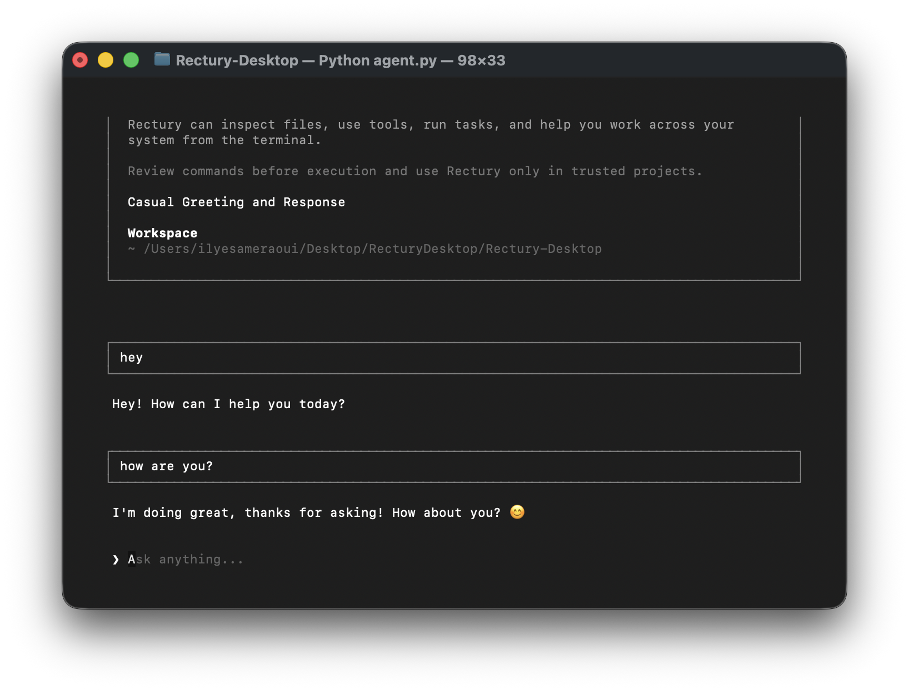
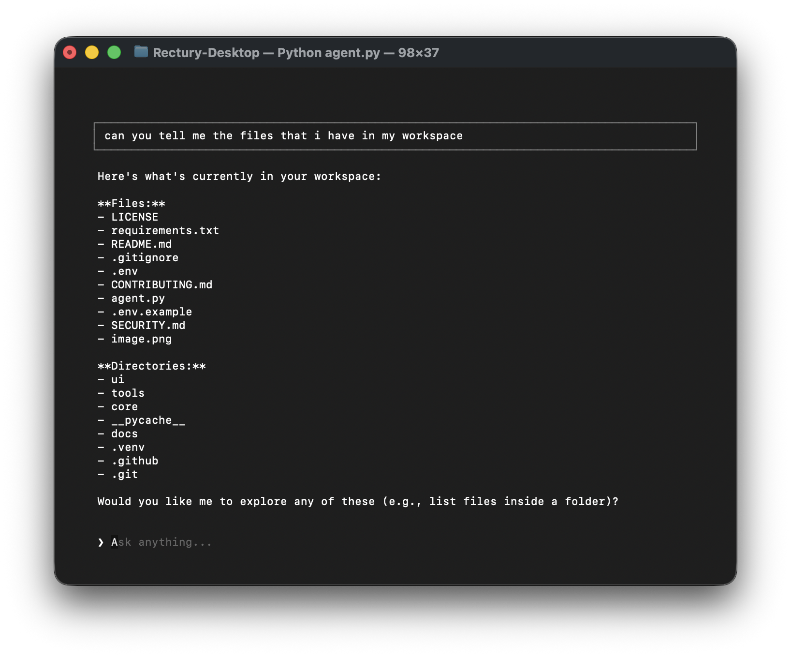

# Rectury

[](https://github.com/Rectury-AI/Rectury-Desktop/actions/workflows/ci.yml)
[](LICENSE)


[](https://github.com/Rectury-AI/Rectury-Desktop/stargazers)
[](https://github.com/Rectury-AI/Rectury-Desktop/issues)

**Talk to your computer from the terminal.**

Rectury is an open-source personal computer agent that connects a language
model to a controlled set of local tools. Ask for something in natural
language, watch the response stream in real time, and let the agent use
explicit tools when the task requires action.

> Rectury is experimental and under active development. Its APIs and internal
> structure may change while the core agent becomes more capable.

## See It in Action

### Start a Conversation

Rectury provides a clean, keyboard-first interface built with Textual.



## What Works Today

- Interactive terminal interface
- Streaming assistant responses
- Multi-step tool calls
- OpenAI-compatible model providers
- JSON tool schemas and a Python tool registry
- Extensible tool implementations
- Local environment configuration
- Local conversation history with generated titles

The first available tool, `list_files_in_dir`, lets Rectury inspect the
contents of a directory. More filesystem and computer-control tools are
planned.

## Quick Start

### 1. Clone the Repository

```bash
git clone https://github.com/Rectury-AI/Rectury-Desktop.git
cd Rectury-Desktop
```

### 2. Create the Environment

Rectury requires Python 3.10 or newer.

```bash
python3 -m venv .venv
source .venv/bin/activate
python3 -m pip install -r requirements.txt
```

On Windows, activate the environment with:

```powershell
.venv\Scripts\activate
```

### 3. Configure a Model

Copy the example configuration:

```bash
cp .env.example .env
```

Then edit `.env`:

```env
AI_PROVIDER=xai
AI_MODEL=grok-4.3
AI_API_KEY=your-xai-api-key
AI_BASE_URL=https://api.x.ai/v1
```

Rectury works with providers that expose an OpenAI-compatible API, including
OpenAI, OpenRouter, xAI, and local Ollama models.

For xAI/Grok, put the key from the xAI Console in `AI_API_KEY`. Rectury also
supports `XAI_API_KEY` as a fallback when `AI_PROVIDER=xai`.

```env
AI_PROVIDER=xai
AI_MODEL=grok-4.3
AI_API_KEY=xai-your-key-here
AI_BASE_URL=https://api.x.ai/v1
```

You can also configure this inside the app with `/models` and selecting
`xAI: Grok 4.3`.

For Ollama, a configuration can look like this:

```env
AI_PROVIDER=ollama
AI_MODEL=qwen3
AI_API_KEY=ollama
AI_BASE_URL=http://localhost:11434/v1
```

### 4. Run Rectury

```bash
python3 agent.py
```

## Project Structure

```text
Rectury-Desktop/
├── agent.py                  CLI entry point and runtime bootstrap
├── core/                     Agent loop, model client, context, safety, state
├── tools/
│   ├── <tool_name>/          Tool package with prompt.py and tool.py
│   ├── functions/            Shared tool implementations
│   ├── catalog.py            Tool schemas sent to the model
│   ├── manifest.py           Ordered tool package manifest
│   └── registry.py           Tool dispatch registry
├── ui/                       Textual terminal interface
├── scripts/                  Build and release helpers
├── tests/                    CLI, context, and integration coverage
├── docs/images/              README screenshots and visual docs
└── examples/
    └── website/              Vite/React website prototype
```

Generated folders such as `.venv/`, `.venv-build/`, `release/`,
`.pytest_cache/`, `__pycache__/`, and `examples/website/node_modules/` are
ignored so the repository stays focused on source files.

## Where Rectury Is Going

The goal is broader than chat: Rectury is being built toward a local-first
agent that can help operate and automate a personal computer.

Conversations are stored as JSON files in `~/.rectury/conversations/`. Rectury
automatically resumes the most recently updated conversation when it starts.

Planned areas include:

- More filesystem tools for reading, searching, creating, copying, and moving
  files
- Permission prompts for sensitive actions
- Structured tool results and clearer execution status
- Conversation browsing and creating new sessions from the interface
- Desktop and browser automation
- Repeatable multi-step workflows

## Safety Direction

Rectury is designed around an explicit boundary between the model and the
system. The model proposes tool calls; trusted local code validates and
executes them.

The project is moving toward:

- Clear permission prompts for risky operations
- No hidden background actions
- No destructive actions without confirmation
- Useful errors when a tool cannot run
- Local execution boundaries that remain easy to inspect

Only run Rectury inside projects and directories you trust.

## How Tools Work

The model does not access your system directly. It requests a defined tool,
local Python code executes it, and the result is returned to the conversation.



```text
You ask -> Model chooses a tool -> Rectury runs it -> Model responds
```

Adding a tool keeps execution and prompt metadata separate:

```text
tools/
├── <tool_name>/
│   ├── prompt.py      Prompt/schema sent to the model
│   └── tool.py        Wrapper pointing at the implementation
├── catalog.py         Builds the model-facing tool list
├── manifest.py        Keeps tool order and imports explicit
├── registry.py        Connects tool names to Python functions
└── functions/         Shared implementations
```

This separation keeps tool execution inspectable: the model can request an
action, but local code remains responsible for what actually runs.

## Contributing

Rectury is still early, but every focused contribution helps shape its direction.
Bug reports, architecture discussions, new tools, and UI improvements are all
welcome.

1. Fork the repository.
2. Create a feature branch.
3. Make and test your changes.
4. Open a pull request explaining what changed and why.

## License

Rectury is released under the [MIT License](LICENSE).
